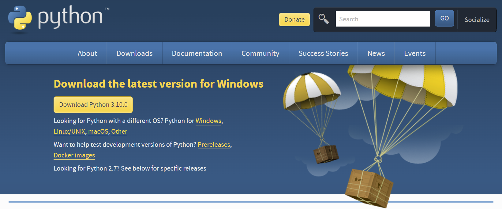
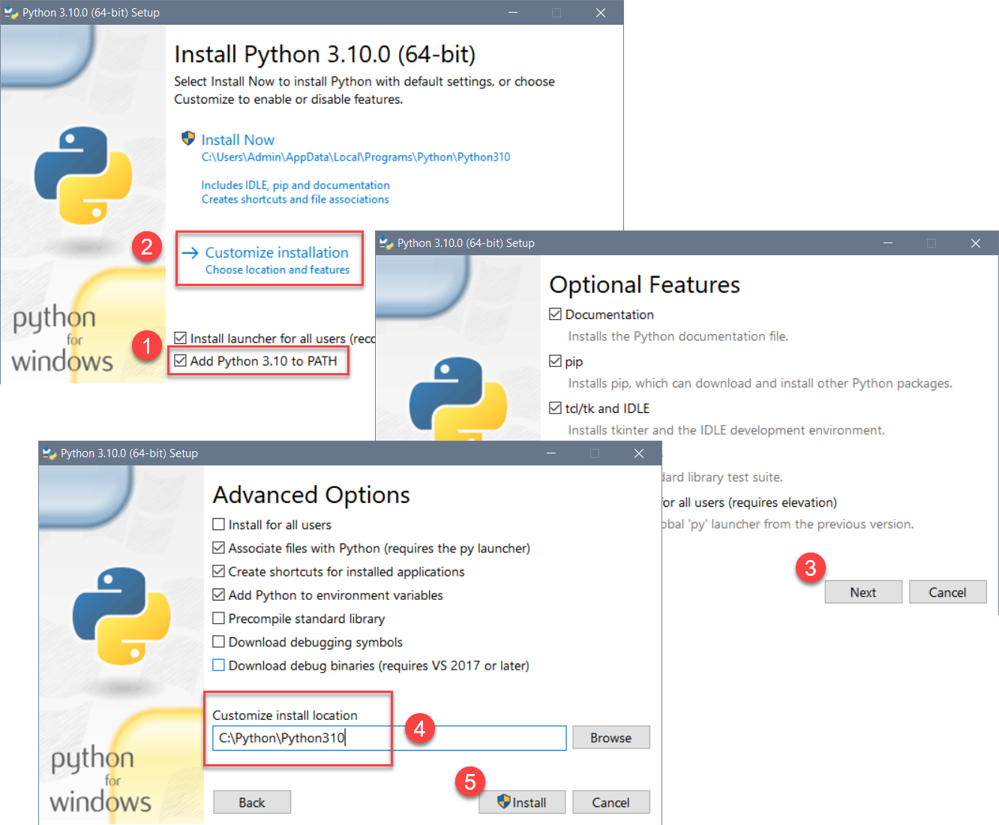

# Python Basics
In this demo we will cover some basic information that will help you install and start programming in Python.

## What is Python
Python is a simple yet powerful programing language. It is an easy language to learn but still powerful due to the extensive pre-made code modules you can freely download (code modules are files with code in them.) 

Here are some facts to know:

-	Python is free to use, even for commercial products! 
- Python runs on Windows, Linux/Unix, and Mac OS X 
-	There are two main versions of Python 2.x and 3.x 
- Both version 2.x and 3.x can be installed on the same computer
-	Mac already has 2.x installed  
-	Python 2.x has been deprecated as of January 2020
-	Python 3.x is recommended for all new projects

## Installing Python
Python is easy to download and install.  A quick internet search will provide you with a download link and several installation videos based on your chosen OS. https.//www.google.com/search?q=How+to+install+python (external site). This page is context-sensitive and should recognize your OS then provide the appropriate download option.

*Note:* If you install both, make sure to use the correct version when running your scripts. You can check  version you are running using the -V switch from the command terminal of your computer (Figure 1).

e Showing the version number after using the -V option](./images/Figure01.png "Show Version with -V")
Figure 1. Verifying Python's version

## Installing Python
To install Python, you must first download the installation program from  https.//www.python.org/downloads/ website (Figure 2). 

<!-- Switching to HTML tag for better control
 -->

 
Figure 2. Downloading Python's installation program

Afterward, you run the .exe or .dmg file to start the installation, depending on your operating system. 
For a Windows installation, I recommend you check the checkbox to include Python's executable in the OS path, then click the custom option to choose an easy-to-access location like C.\Python\Python3.x for its installation folder (Figure 3).

 
Figure 3. Customizing the Python installation

The Mac installer has fewer options than the Windows version and more text to read, but selecting the default options is fine.

 
Figure 3. The Python installation on Mac OS

##Running Python

## Summary
In this demo we covered how to install and start programming in Python.
