# Python Basics  

In this demo we will cover the basics of installing, running, and programming with Python. By the end of this demonstration you will know how Python can be installed and used on your Mac or Windows computer.


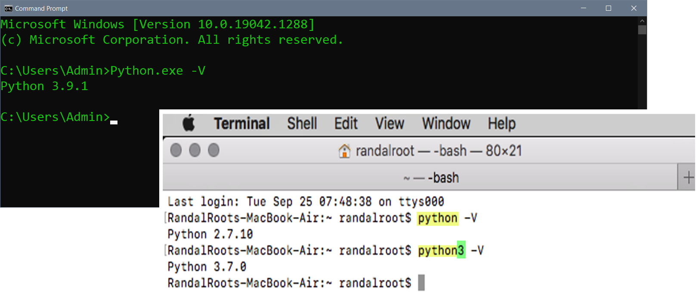

_Figure 1. Python.org Website_

## What is Python?
Python is a simple yet powerful programing language. It is an easy language to learn but still powerful due to the extensive pre-made code modules you can download freely (code modules are files with code in them.) 

Here are some good facts to know about Python:

-	Python is free to use, even for commercial products
- Python runs on Windows, Linux/Unix, and Mac OS X 
-	There are two main versions of Python 2.x and 3.x 
- Both versions 2.x and 3.x can be installed on the same computer
-	Mac already has 2.x installed  
-	Python 2.x has been deprecated as of January 2020
-	Python 3.x is recommended for all new projects


## Installing Python
Python is easy to download and install. A quick internet search will provide you with a download link and several installation videos based on your chosen OS. [https://www.google.com/search?q=How+to+install+python](https://www.google.com/search?q=How+to+install+python) (external site). 

You must first download the installation program from the [https://www.python.org/downloads/](https://www.python.org/downloads/) website (Figure 2). This page is context-sensitive, so it should recognize your OS and then provide the appropriate download option. Afterward, you run the Windows .exe or the macOS .pkg file to begin installing. 
 
 _Steps:_ 
  1. Navigate to [**Python.Org**](https://www.python.org/downloads/) (external Site)
  2. Select **Download Python**.
  3. Run the **exe** or **pkg** file.

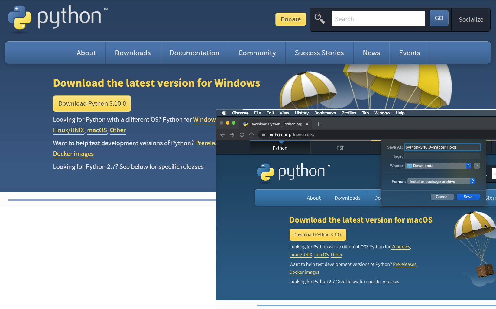

_Figure 2. Downloading Python's installation program_

For a Windows installation, I recommend you check the checkbox to include Python's executable in the OS path, then click the custom option to choose an easy-to-access location like **C.\Python\Python3.x** for its installation folder (Figure 3).

 _Steps:_
  1. Check **Add Python to Path** checkbox.
  2. Select **Customize Installation**.
  3. Select **Next** to advance dialog.
  4. Configure **Customize install location** textboxt.
  5. Select **Install**

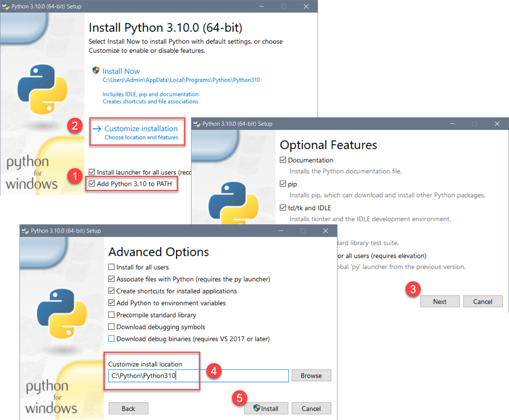 

_Figure 3. Customizing the Python installation_


The Mac installer has fewer options than the Windows version and more text to read, but selecting the default options is fine. At the inend of the installation your newly installed files will appear in Finder (Figure 4).

 _Steps:_
  1. Read the introduction page then select **Continue**
  2. Read the Read Me page then select **Continue**
  3. Read the License page then select **Continue**
  4. Select **Agree** to continue the installation
  5. Read the Installation Type page then select **Install**
  6. Close **Finder** after it appears

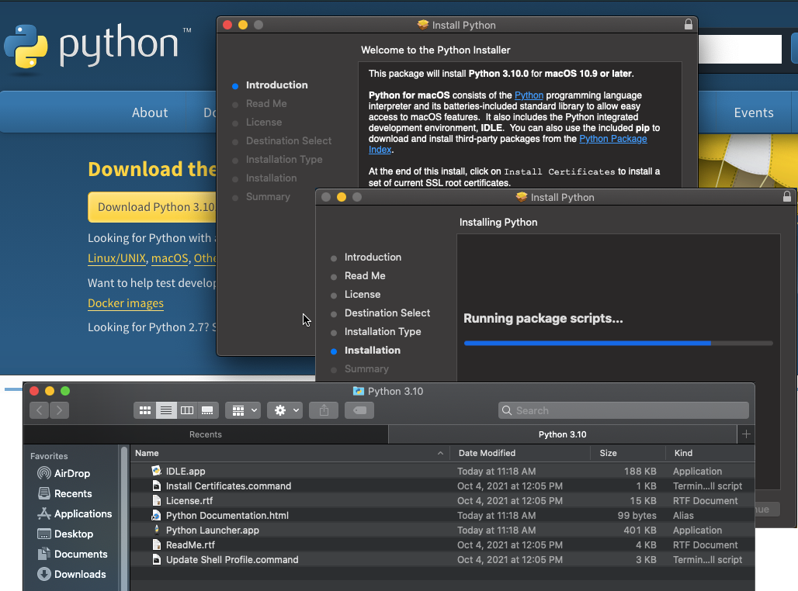

_Figure 4. The Python installation on Mac OS_


**_Important:_** Restarting your Mac is recommend after the installation and may be required on some computers.

## Demonstration
In this demonstration, we will walk through the process of installing Python on a Windows computer. You are encouraged to follow along if you would like. Though this demo will be on Windows, you can follow on a Mac, but remember that you may have to restart your computer and log back into the session.

 This demo consists of the following steps:

  1. Download the Python installer from Python.Org.
  2. Run the installation program.

In this demonstration, you saw how to install Python on a Windows computer. Next, we will look at how to use your installation.

<hr/>


## Running Python
Once you have installed Python, you can run Python code interactively using a Console/Terminal or by creating a script with its code editor IDLE. Both options have their place, and I recommend you use both. 

### The Console/Terminal Interface
To open a command console in Windows 10, click the Start button, then type in the command **__CMD__** into **Open** the textbox. Clicking the Command Prompt App option opens a command prompt window. With the Command Prompt open, type Python.exe to begin an interactive session (Figure 5).

_Steps:_
 1. Select **Start**
 2. Type **_CMD_**
 3. Select **Command Prompt App**

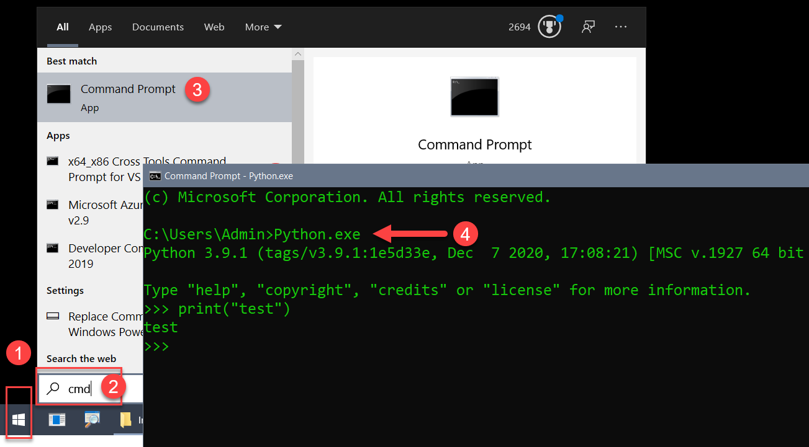

_Figure 5. The Run dialog window_


It is almost the same if you use a Mac, but now the Command Prompt is called a "Terminal" window. Open a Terminal window using **_Finder > Applications > Utilities > Terminal.app_**. You can access Python's interactive mode by typing in the "Python3" command in the Terminal window (Figure 6).

_Steps:_
 1. Open **Finder**
 2. Navigate to **Utilities**
 3. Open **Terminal.app**
 
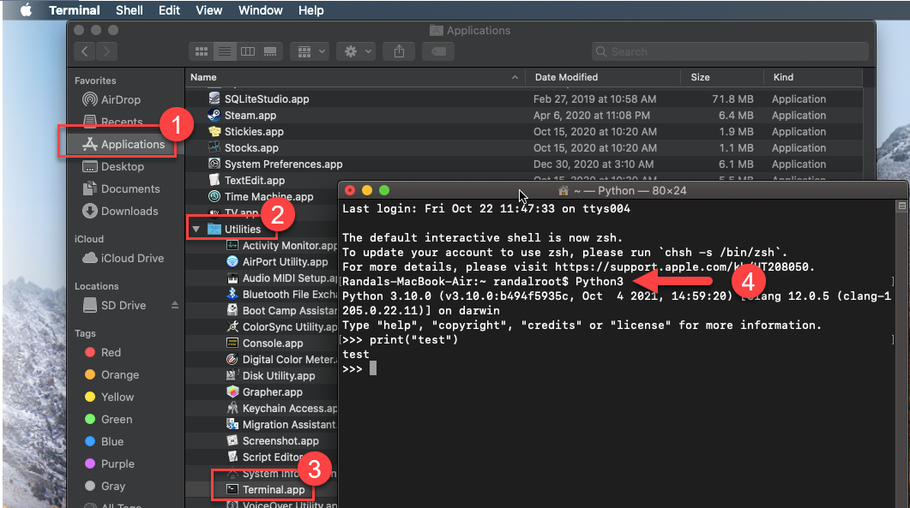

_Figure 6. A Mac Command prompt_


**Note:** The macOS includes Python 2.x, so use the correct version when running your code. On Mac, typing **_python3_** will connect to your Python 3.x installation, while typing **_python_** connects to the Python 2.x installation. You can verify the version you are running using the -V switch from the command terminal of your computer (Figure 7). 
  
 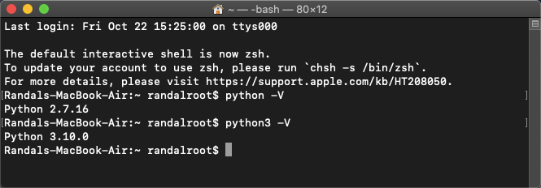
 
_Figure 7. Running multiple versions of Python on the Mac OS_

## Demonstration
In this demonstration, we will walk through the process of using Python's Interactive console/terminal application. You are encouraged to follow along if you would like. Though I will be using Windows, the process is very similar on macOS.

This demo consists of the following steps:

 1. Open a command prompt and start Python in interactive mode.
 2. Use the following common commands, one at a time, to show how the interactive mode works.

 ```python
 first_name = input("Enter your first name")
 last_name = input("Enter your last name")
 print("You entered:", first_name, last_name)

 ```
 
 In this demonstration, we learned how to use Python's Interactive console/terminal application. Next, we will learn about Python's built-in code editor.
 
 <hr/>
 

### The IDLE Code Editor
You can create and run Python code files (Scripts) using its built-in code editor called IDLE. Code editors are like text editors, but they also allow you to run and sometimes debugging your code. IDLE is not that sophisticated and has limited features, but it is simple to use and good enough to use when your are first learning Python. You can find out more about its features via an internet search; [https://www.google.com/search?q=How+to+use+Python+idle](https://www.google.com/search?q=How+to+use+Python+idle) (external site).

_Steps for Windows:_
 1.	Click the **Start** menu icon.
 2.	Type **_idle_** to search for the application.
 3.	Launch **IDLE** from the menu presented.

_Steps for macOS:_
 1.	Click on **Finder**.
 2.	Type in **_idle.app_** to search for the application.
 3.	Launch **IDLE.app** when the is file found.

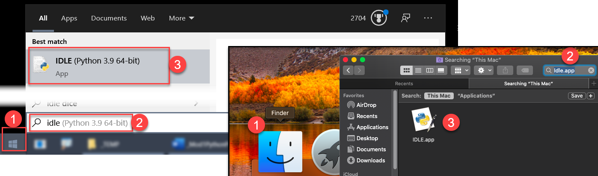

_Figure 8. Steps to open the Python's IDLE Application_


Once IDLE opens, you can use its interactive mode as you do from a console/terminal window or create script files using the **_File > New File_** menu item.

## Demonstration
In this demonstration, we will walk through the process of using Python's IDLE code editor. You are encouraged to follow along if you would like. Though I will be using Windows, the process is very similar on macOS.

This demo consists of the following steps:

Interactive Mode
 1. Open **IDLE**.
 2. Note that IDLE starts in **interactive mode**.
 3. Use the following common commands, one at a time, to show how the interactive mode works.

 ```python
 first_name = input("Enter your first name")
 last_name = input("Enter your last name")
 print("You entered:", first_name, last_name)

 ```
Creating Scripts
 1. Select **File > New File**.
 2. Type, or copy and paste, code into the **text area**.
 3. Select **Run > Run Module**.
 4. Select **OK** to save the file.
 5. Save file as **_test.py**.
 6. Note that the results are displayed in the **interactive window**.

File Editing
 1. Download the Python code file [demo01.py](../codefiles/demo01.py "download to open file in IDLE")
 2. Click the **Raw** button (figure 9)
 3. Download the file to your Downloads folder 
 4. Open the file **File > Open... >**

  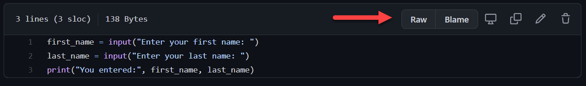
  Figure 9. The Github file Raw button
  
 
   **Chrome** and **Firefox** (figure 10):  
   1. Right-Click and use **Save As...** or **Save Page as**.
   
   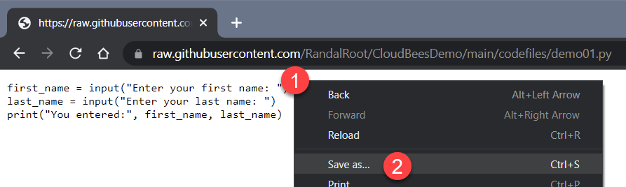

   _Figure 10. Saving the code file using the Chrome browser_
   
   
   **Safari** (figure 11):
   1. Right-Click and use **Save As...**.
   2. Retype the name as **_demo01.py_**.
   3. Set the Format as **Page Source**.
   4. Click the **Save** button.
   5. Click the **Don't append** button to avoid having the **.txt** extension added.
   6. Use **_File > Open_** menu item in IDLE to locate and open the file.
   
   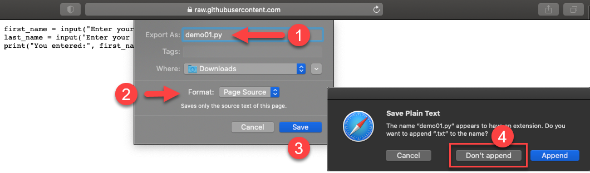
   
   _Figure 11. Saving the code file using the Safari browser_   
 
  
In this demonstration, you saw how to use Python's code editor IDLE. Many editors are available for working with Python, but this is the one that comes with a Python installation.

<hr/>


## The Python interpreter
Whether you use the interactive console/terminal or the windowed editor option, the code you enter is sent to the Python interpreter for processing (figure 9. This interpreter application is what we refer to when we say your code runs on Python. 
 
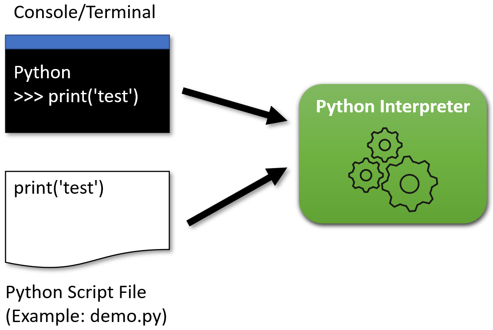
 
_Figure 14. The Python interpreter_


## Summary
In this demo, we covered how to install and start programming in Python. While we only covered the very basics, there is more material I can share if you are interested. My contact info is on the [Google Slides](https://docs.google.com/presentation/d/10KeZQ35RM3d9cDY5KNjvyz2z844UNtCt5Nl7brti-VQ/edit#slide=id.p) presentation.

