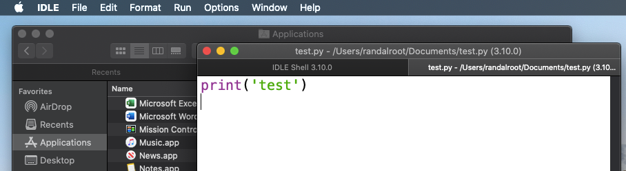

# Python Basics  

In this demo we will cover the basics of installing, running, and programming with Python. By the end of this demonstration you will know how Python can be installed and used on your Mac or Windows computer.


 
_Figure 1. Python.org Website_

## What is Python?
Python is a simple yet powerful programing language. It is an easy language to learn but still powerful due to the extensive pre-made code modules you can download freely (code modules are files with code in them.) 

Here are some good facts to know about Python:

-	Python is free to use, even for commercial products! 
- Python runs on Windows, Linux/Unix, and Mac OS X 
-	There are two main versions of Python 2.x and 3.x 
- Both versions 2.x and 3.x can be installed on the same computer
-	Mac already has 2.x installed  
-	Python 2.x has been deprecated as of January 2020
-	Python 3.x is recommended for all new projects


## Installing Python
Python is easy to download and install. A quick internet search will provide you with a download link and several installation videos based on your chosen OS. [https://www.google.com/search?q=How+to+install+python](https://www.google.com/search?q=How+to+install+python) (external site). 

You must first download the installation program from the [https://www.python.org/downloads/](https://www.python.org/downloads/) website (Figure 2). This page is context-sensitive, so it should recognize your OS and then provide the appropriate download option. Afterward, you run the Windows .exe or the macOS .pkg file to begin installing. 
 
 Steps: 
 1. Navigate to [**Python.Org**](https://www.python.org/downloads/)
 2. Click **Download** Python's Installer.
 3. Run the **Exe** or **pkg** file.


_Figure 2. Downloading Python's installation program_

For a Windows installation, I recommend you check the checkbox to include Python's executable in the OS path, then click the custom option to choose an easy-to-access location like **C.\Python\Python3.x** for its installation folder (Figure 3).

 Steps:
 1. Click **Add Python to Path** checkbox.
 2. Click **Customize Installation**.
 3. Click **Next** to advance dialog.
 4. Configure **Customize install location** textboxt.
 5. Click **Install**

 

_Figure 3. Customizing the Python installation_


The Mac installer has fewer options than the Windows version and more text to read, but selecting the default options is fine (Figure 4).


_Figure 4. The Python installation on Mac OS_


**_Important:_** Restarting your Mac is recommend after the installation and may be required on some computers.

## Demonstration
In this demonstration, we will walk through the process of installing Python on a Windows computer. You are encouraged to follow along if you would like. Though this demo will be on Windows, you can follow on a Mac, but remember that you may have to restart your computer and log back into the session.

 This demo consists of the following steps:

 1. Download the Python installer from Python.Org.
 2. Run the installation program.

In this demonstration, you saw how to install Python on a Windows computer. Next, we will look at how to use your installation.

<hr/>

## Running Python
Once you have installed Python, you can run Python code interactively using a Console/Terminal or by creating a script with a code editor. Both options have their place, and I recommend you always test your programs using both. 

### The Console/Terminal Interface
To open a command console in Windows 10, click the Start button, then type in the command "CMD" into "Open" the textbox. Clicking the Command Prompt App option opens a command prompt window. With the Command Prompt open, type Python.exe to begin an interactive session (Figure 5).


_Figure 5. The Run dialog window_


It is almost the same if you use a Mac, but now the Command Prompt is called a "Terminal" window. Open a Terminal window using Finder > Applications > Utilities > Terminal.app. You can access Python's interactive mode by typing in the "Python3" command in the Terminal window (Figure 6).
 


_Figure 6. A Mac Command prompt_


**Note:** Remember, the macOS includes Python 2.x, so remember to use the correct version when running your code. On Mac, typing "python3" should connect you to your Python 3.x installation, while typing "python" will connect you to the Python 2.x installation. You can verify the version you are running using the -V switch from the command terminal of your computer (Figure 7). 
  
 
 
_Figure 7. Running multiple versions of Python on the Mac OS_


### The IDLE Code Editor
You can create and run Python code files (Scripts) using its built-in code editor called IDLE. Code editors are like text editors, but they include running and editing the code you type. IDLE is simple to use, but you can find out more about its features via an internet search; https://www.google.com/search?q=How+to+use+Python+idle (external site).

To use IDLE on Windows:
1.	Click the Start menu icon.
2.	Type "idle" to search for the application.
3.	Launch IDLE from the link presented.

To use IDLE macOS:
1.	Click on Finder
2.	Type in "idle.app" to search for the application.
3.	Launch IDLE from the file presented.



_Figure 8. Steps to open the Python's IDLE Application_


Once IDLE opens, you can use its interactive mode as you do from a console/terminal window or create script files using the **_"File" > "New File"_** menu item.

## Demonstration
In this demonstration, we will walk through the process of using Python's Interactive console/terminal application and its IDLE code editor. You are encouraged to follow along if you would like. Though I will be using Windows, the process is very similar on macOS.

This demo consists of the following steps:

1. Open a command prompt and start Python in interactive mode.
2. Use the following common commands, one at a time, to show how the interactive mode works.

```python
first_name = input("Enter your first name")
last_name = input("Enter your last name")
print("You entered:", first_name, last_name)

```
5. Download the Python code file [demo01.py](../codefiles/demo01.py "download to open file in IDLE") and open it in IDLE:
 
   1. Click on the provide link to access the file's GitHub page.
   2. Click the "Raw" button (figure 9)

     
   
   Figure 9. The Github file Raw button
   
   3. Download the file to your Downloads folder:

    On Chrome and Firefox (figure 10):    
     1. Right-Click the displayed textpage and use the "Save As..." or "Save Page as" menu option to save the file.
   
     
   
    _Figure 10. Saving the code file using the Chrome browser_
   
   On macOS Safari (figure 11):
    1. Right-Click the displayed textpage and use the "Save As..." menu option.
    2. Retype the name as demo01.py.
    3. Set the Format as "Page Source."  
    4. Click the Save button.
    5. Click the "Don't append" button to avoid having the ".txt" extension added.

    
   
    _Figure 11. Saving the code file using the Safari browser_
    
 4. After the code file has been downloaded, use the **_File > Open_** menu item in IDLE to locate and open it in the editor.

  IDLE on Windows (figure 12)

  
 
  _Figure 12. Opening a code file using IDLE on Windows_
 
  IDLE on macOS (figure 13)

  
 
  _Figure 13. Opening a code file using IDLE on macOS_
 
 
In this demonstration, you saw how to use Python's interactive mode and its code editor IDLE. Many editors are available for working with Python, but these are the two that come with the Python installation.

<hr/>


## The Python interpreter
Whether you use the interactive console/terminal or the windowed editor option, the code you enter is sent to the Python interpreter for processing (figure 9. This interpreter application is what we refer to when we say your code runs on Python. 
 

 
_Figure 14. The Python interpreter_


## Summary
In this demo, we covered how to install and start programming in Python. While we only covered the very basics, there is more material I can share if you are interested. My contact info is on the [Google Slides](https://docs.google.com/presentation/d/10KeZQ35RM3d9cDY5KNjvyz2z844UNtCt5Nl7brti-VQ/edit#slide=id.p) presentation.

